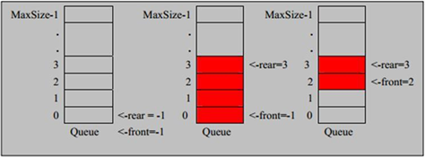

# 队列

### 1.定义
- 队列是一个有序列表，可以用数组或是链表来实现。
- 遵循先入先出的原则。即：先存入队列的数据，要先取出。后存入的要后取出

### 2.模拟思路
- 队列本身是有序列表，若使用数组的结构来存储队列的数据，则队列数组的声明如下图, 其中 maxSize 是该队列的最大容量

- 因为队列的输出、输入是分别从前后端来处理，因此需要两个变量 front及 rear分别记录队列前后端的下标，front 会随着数据输出而改变，而 rear则是随着数据输入而改变，如图所示:

    

**数组入队出队操作模拟**

当我们将数据存入队列时称为”addQueue”，addQueue 的处理需要有两个步骤：

- 将尾指针往后移：rear+1 , 当 front == rear 时，队列为空

- 若尾指针 rear 小于队列的最大下标 maxSize-1，则将数据存入 rear所指的数组元素中，否则无法存入数据。rear == maxSize - 1时，队列满

>注意：front指向的是队列首元素的前一个位置

### 3.代码实现

[模拟普通队列（有缺陷）](./ArrayQueue.java)

运行结果

```java
1
1
2
1 2 3 
```